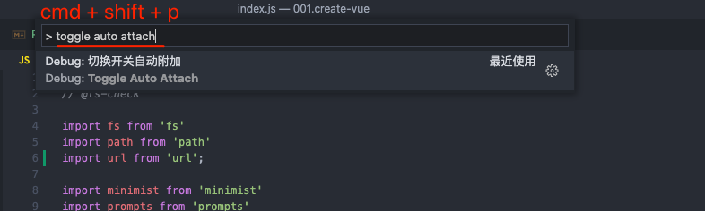
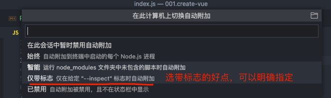
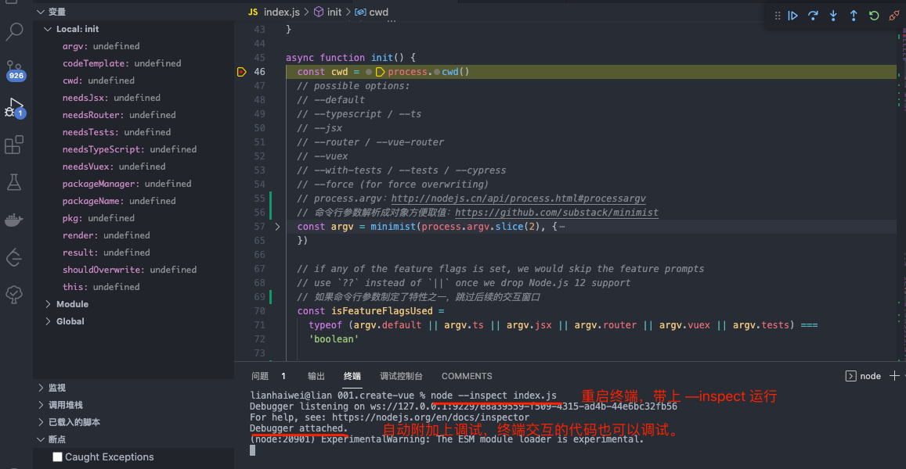

## 自动附加

[VS Code 官方调试文档](https://code.visualstudio.com/docs/nodejs/nodejs-debugging)

1. 在 `VS Code` 里按下 `cmd + shift + p` 打开命令面板。

2. 搜索 `toggle auto attach` 并确认。

3. 选择仅带标志(仅在给定 "--inspect" 标志时自动附加)。

4. 用 `node --inspect xxx.js` 运行文件进入调试模式。

