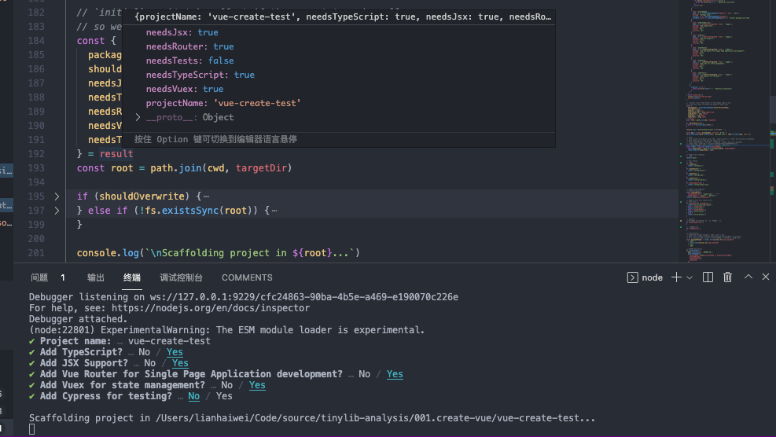
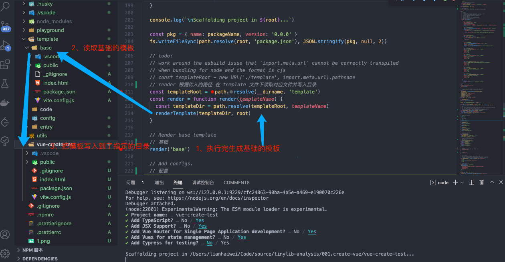

# 001.\[create-vue\]-Vue 团队公开的全新脚手架工具

## 前言

Vue 新公开的脚手架工具 <https://github.com/vuejs/create-vue>。

## 示例

只需在终端执行 `npm init vue@next` 按照提示即可创建一个项目。

## 环境

### 调试环境

因为涉及到终端交互，所以要用总端运行命令。这里采用调试自动附加功能。这里单独记录一次，这个已经单独提取出来以后引用这个地址。

[自动附加调试方法](https://github.com/haiweilian/tinylib-analysis/issues/1)

1. 在 `VS Code` 里按下 `cmd + shift + p` 打开命令面板。

2. 搜索 `toggle auto attach` 并确认。


3. 选择仅带标志(仅在给定 "--inspect" 标志时自动附加)。


4. 用 `node --inspect xxx.js` 运行文件进入调试模式。


### 调试问题

调试的时候 `__dirname` 错误问题，解决办法如下。

```js
// https://stackoverflow.com/questions/64383909/dirname-is-not-defined-in-node-14-version
// https://github.com/nodejs/help/issues/2907

import { fileURLToPath } from 'url'
import { dirname } from 'path'

const __filename = fileURLToPath(import.meta.url)
const __dirname = dirname(__filename)
// 作者：若川
// 链接：https://juejin.cn/post/7018344866811740173
// 来源：稀土掘金
// 著作权归作者所有。商业转载请联系作者获得授权，非商业转载请注明出处。
```

## 源码

### 解析命令参数

开始先解析命令行传递的参数，用到 [minimist](https://github.com/substack/minimist) 库解析用法参考文档。

```js
async function init() {
  const cwd = process.cwd()
  // http://nodejs.cn/api/process.html#processargv
  // https://github.com/substack/minimist
  const argv = minimist(process.argv.slice(2), {
    alias: {
      typescript: ['ts'],
      'with-tests': ['tests', 'cypress'],
      router: ['vue-router']
    },
    boolean: true
  })
}
```

### 交互式询问

总端交互通过 [prompts](https://github.com/terkelg/prompts) 库实现用法参考文档。

```js
// 最后的结果 { key: boolean } 的格式
let result = {}

try {
  result = await prompts(
    [
      // ....
      {
        name: 'needsVuex',
        type: () => (isFeatureFlagsUsed ? null : 'toggle'),
        message: 'Add Vuex for state management?',
        initial: false,
        active: 'Yes',
        inactive: 'No'
      },
      {
        name: 'needsTests',
        type: () => (isFeatureFlagsUsed ? null : 'toggle'),
        message: 'Add Cypress for testing?',
        initial: false,
        active: 'Yes',
        inactive: 'No'
      }
    ],
    {
      onCancel: () => {
        throw new Error(red('✖') + ' Operation cancelled')
      }
    }
  )
} catch (cancelled) {
  process.exit(1)
}
```

如下选择之后结果保存在 `result` 下输入结果如下。



```js
{
  projectName: 'vue-create-test'
  needsVuex: true
  needsTypeScript: true
  needsTests: false
  needsRouter: true
  needsJsx: true
}
```

### 配置 + 模板 = 文件

先看一个基础怎么生成的。

```js
const templateRoot = path.resolve(__dirname, 'template')
const render = function render(templateName) {
  const templateDir = path.resolve(templateRoot, templateName)
  // 1、根据传入的路径 在 template 文件下读取对应文件并写入目录
  // 2、深度合并两个 package.json 的内容
  renderTemplate(templateDir, root)
}

// 基础模板
render('base')
```



其他的生成都是一样的逻辑，就是读入模板中的片段组合起来最终生成完整的。

```js
// Add configs.
if (needsJsx) {
  render('config/jsx')
}
if (needsRouter) {
  render('config/router')
}
if (needsVuex) {
  render('config/vuex')
}
if (needsTests) {
  render('config/cypress')
}
if (needsTypeScript) {
  render('config/typescript')
}

// Render code template.
// Render entry file (main.js/ts).
// ...
```

### 友好提示

提示不同的包管理工具命令，但是这个需要使用对应的命令去初始化，比如 `npm init`， `yarn init`、 `pnpm init`

```js
// Instructions:
// Supported package managers: pnpm > yarn > npm
// Note: until <https://github.com/pnpm/pnpm/issues/3505> is resolved,
// it is not possible to tell if the command is called by `pnpm init`.
const packageManager = /pnpm/.test(process.env.npm_execpath)
  ? 'pnpm'
  : /yarn/.test(process.env.npm_execpath)
  ? 'yarn'
  : 'npm'
```

最后还可以使用 [kolorist](https://github.com/marvinhagemeister/kolorist) 包输出一些带颜色的提示语。

```js
console.log(`\nDone. Now run:\n`)
if (root !== cwd) {
  console.log(`  ${bold(green(`cd ${path.relative(cwd, root)}`))}`)
}
console.log(`  ${bold(green(getCommand(packageManager, 'install')))}`)
console.log(`  ${bold(green(getCommand(packageManager, 'dev')))}`)
console.log()
```

## 总结

1. 首先扩展知识储备 _minimist(解析命令参数)_、_prompts(终端交互)_ 、_kolorist(终端颜色)_ 的用法和用处。

2. 回顾整个流程从开始的 _参数解析_ 到根据 _解析结果_ 匹配对应的 _预设模板_ 得出 _最终文件_ 的过程，应该有所谓各种生成不过是 _数据 + 模板 = 文件_ 的感慨。
